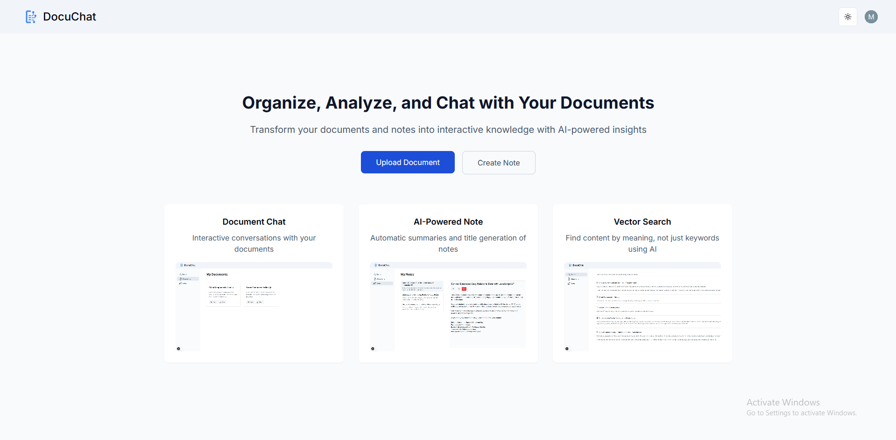

# Intelligent Document and Note Management System

This application provides a simple and efficient way to manage your documents and notes using AI. It combines document storage, AI-powered summarization, chat functionality, note-taking features, and powerful search capabilities in one place.

## Features

- **Document Upload and Management:** Upload, delete, and organize your documents in various formats. You have full control over your document library.

- **Document Summarization:** The system uses AI to generate short, concise summaries of your documents, saving you time.

- **Document Chat:** Interact with your documents through a chat interface. Ask questions and get information directly from the document content. Chat history is saved for your reference.

- **Note Creation and Management:** Create, edit, and delete notes. An AI assistant can suggest titles for your notes.

- **Comprehensive Search:** Easily search across all your documents and notes using keywords. The system uses vector search technology to find relevant information, even if the exact words aren't present.

- **Secure Authentication:** User accounts are protected with secure authentication. Your data is kept private.

## Try It Out!

🔹 **Live Demo:** [View live](https://doc-talk-ai-three.vercel.app)  
🔹 **Video Tutorial:** [Watch video](#)

## Getting Started

1. **Account Creation:** Create an account to access the system.

2. **Document Upload:** Upload your documents to the system. Supported file types will be listed in the application.

3. **Note Creation:** Create notes, get title suggestions, and chat with them if needed.

4. **Using the AI Features:** The AI summarization and title generation features are automatically available after uploading a document or creating a note.

5. **Chatting with Documents:** Select a document and begin chatting to ask questions or get information.

6. **Searching:** Use the search bar to find documents or notes. Try different keywords to explore the search capabilities.

## Technology Used

- **Framework**: Next.js 15.1.4 (React 19)
- **Type Safety**: TypeScript 5
- **Styling**: Tailwind CSS 3.4.1 + Animate
- **Backend**: Convex
- **Authentication**: Clerk
- **AI Integration**: OpenAI
- **UI Components**: Shad-cn UI
- **Form Handling**: React Hook Form + Zod Validation
